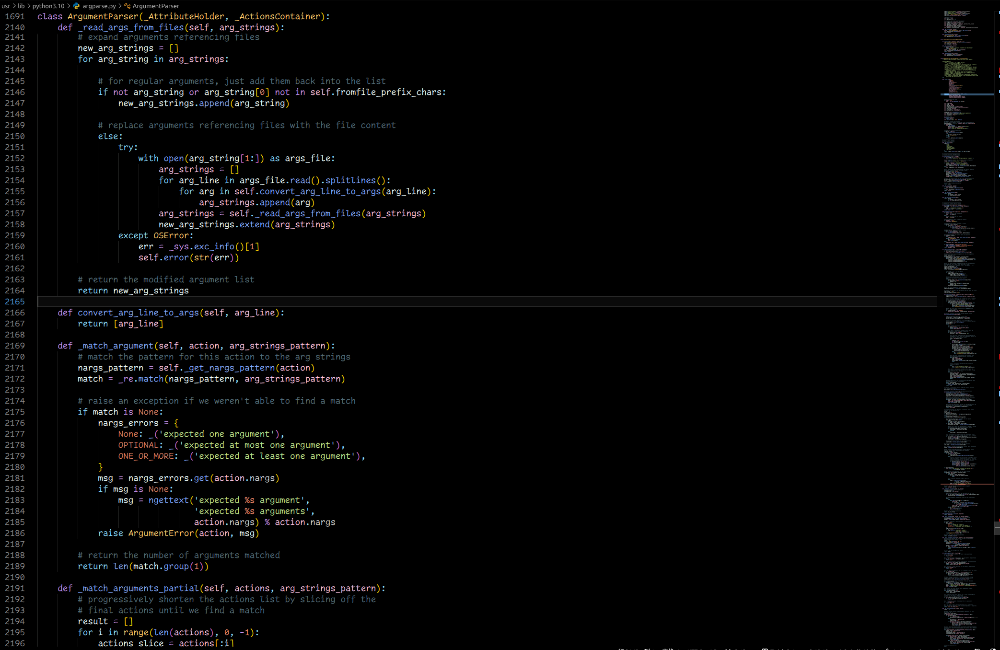

# 🌑 Kids Theme for VS Code

A **pitch-black theme**, designed to follow the **color standards of VS Code** itself — but made for those who find the official VS Code themes **too light**.  
It even includes **compatibility with `.cfg` files**, ensuring consistent visuals across custom configuration files.

---

## ✨ Features

- 🎨 Deep, eye-comforting **pitch black** background
- 🧩 Fully aligned with **VS Code UI colors**
- 🗂️ Enhanced support for `.cfg` files
- 💻 Ideal for long coding sessions or low-light environments
- ⚙️ Super easy installation with automated updates: the theme automatically applies the settings in `settings.json` for a ready-to-use experience
- 📦 Already comes with the ***`Material Icon Theme`*** activated for a modern and organized view of files

---

## ⚙️ Installation

1. Clone or download the theme repository.
2. Open VS Code and go to:  
   `File → Preferences → Color Theme → Install from VSIX...`
3. Select the `.vsix` file (if available), or manually move the theme folder into your `.vscode/extensions` directory.
4. Activate the theme from the Color Theme list.

---

## 📂 File Support

Supports syntax highlighting for:

- `.js`
- `.ts`
- `.json`
- `.yaml`
- `.yml`
- `.xml`
- `.html`
- `.css`
- `.sql`
- `.cpp`
- `.py`
- `.sh`
- `.bash`
- `.zsh`
- `.cfg`
- `.ini`
- `.properties`
- `.env`
- `.markdown`
- `.php`
- `.blade.php`

Custom extensions can be supported via `settings.json`.

---

## 🖼️ Preview

> _"So dark, it absorbs your thoughts..."_



---

## 📌 Why use Kids Theme?

- Perfect for **OLED displays** (saves energy)
- Feels easier on the eyes than dark gray themes
- Great for late-night coding or focus-heavy work
- Reduces visual clutter with a **minimalist approach**

---

## 🛠️ Customization

Want to tweak colors or add support for more file types?  
Just open the `theme.json` file and edit the values, use the built-in theme editor in VS Code, 
and even if you want you can edit it through your `settings.json`.

---

## 🛠️ Recommended Settings


> To ensure the best experience with the **Kids Theme**, we recommend applying the settings below to your `settings.json` — now automated for an even easier and more practical installation!

```json
{
  "workbench.startupEditor": "none",
  "editor.fontSize": 17,
  "editor.lineNumbers": "on",
  "editor.wordWrap": "on",
  "explorer.compactFolders": false,
  "code-runner.runInTerminal": true,
  "code-runner.clearPreviousOutput": true,
  "code-runner.executorMap": {
    "python": "cls ; python -u"
  },
  "code-runner.ignoreSelection": true,
  "security.workspace.trust.untrustedFiles": "open",
  "workbench.editorAssociations": {
    "*.exe": "default",
    "*.pf": "default"
  },
  "explorer.confirmDelete": false,
  "git.autofetch": true,
  "files.autoSave": "afterDelay",
  "files.associations": {
    "*.cfg": "cpp"
  },
  "workbench.iconTheme": "material-icon-theme",
  "workbench.colorTheme": "KIDS THEME COLORFUL",
  "terminal.integrated.defaultProfile.windows": "Powershell",
}
```

---

## 🙌 Credits

> Created with ❤️ by [Alan Marques (M0rdek4y)](https://github.com/MarqueesDev)

---

## 🧠 License

[© MIT License](https://github.com/MarqueesDev/kids-theme/blob/main/LICENSE.txt) — Free to use, modify, and share.
